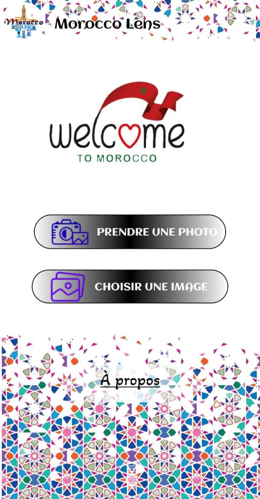
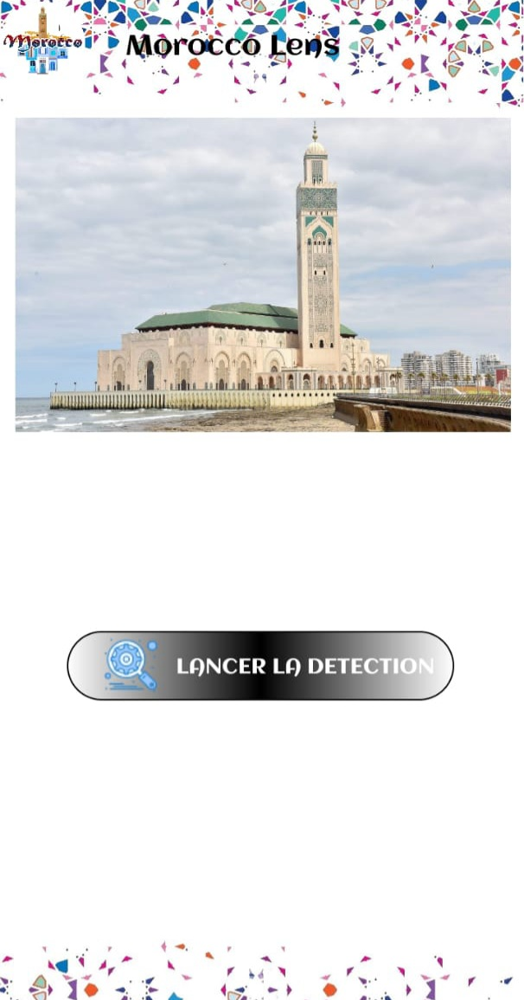
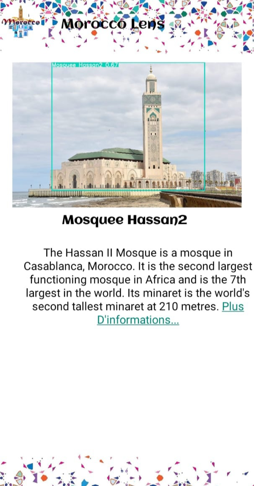
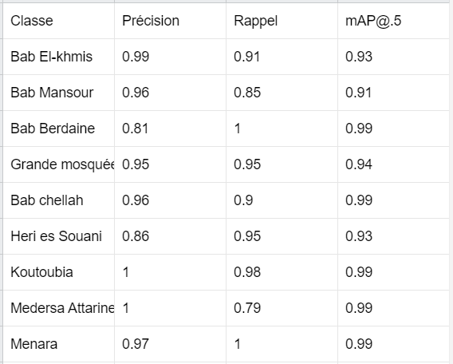
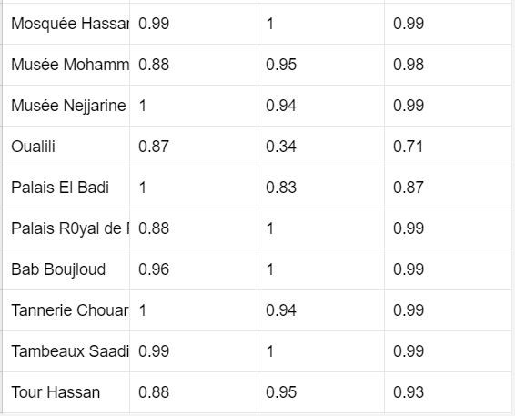

# Android Application For Moroccan Monuments Detection using YOLOV5

This project is an android application detects 19 famous moroccan monuments using YOLOV5 for object detection.

## YOLO

You only look once (YOLO) is a state-of-the-art, real-time object detection system. On a Pascal Titan X it processes images at 30 FPS and has a mAP of 57.9% on COCO test-dev.

## The Application Summary

* Step1: Choose a Picture

* Step2: Click The Detection Button

* Step3: The results show up

## The Model Summary

The model has an overall precision of 94.7%, Recall of 9.91% and mAP@.5 of 95.7%

